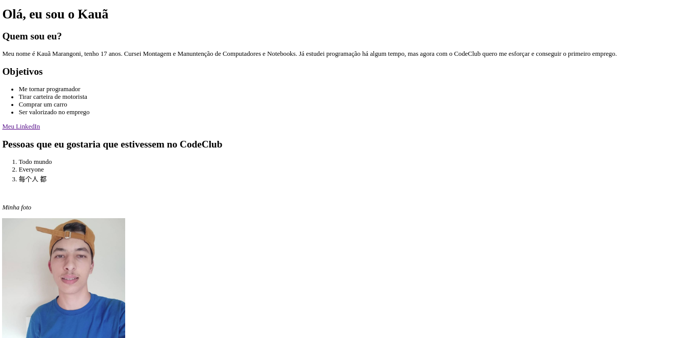

# who-am-I

> Project result Who Am I.

The project was a CodeClub challenge, using only HTML.

## 🤝 Colaborators

<table>
  <tr>
    <td align="center">
      <a href="https://github.com/Kaua-Marangoni">
         
        
          <b>Kauã Marangoni</b>
        
      </a>
    </td>
  </tr>
</table>